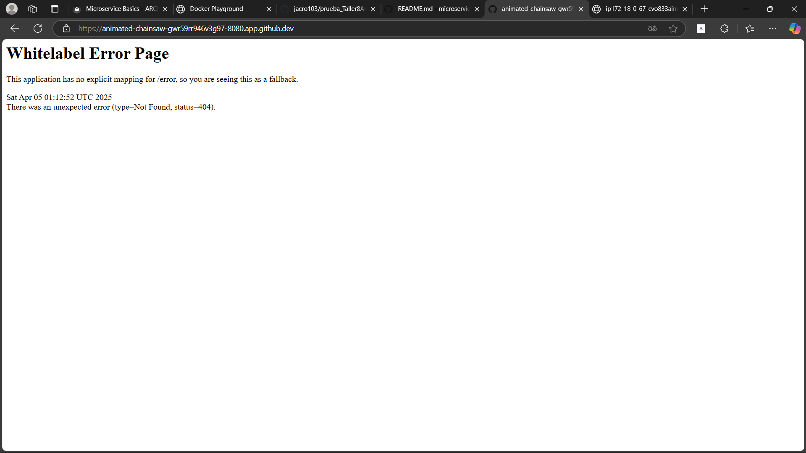
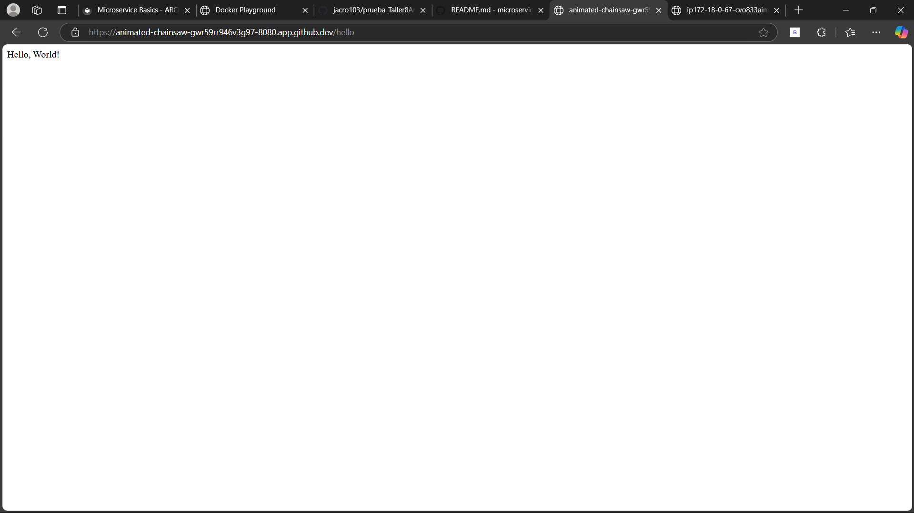
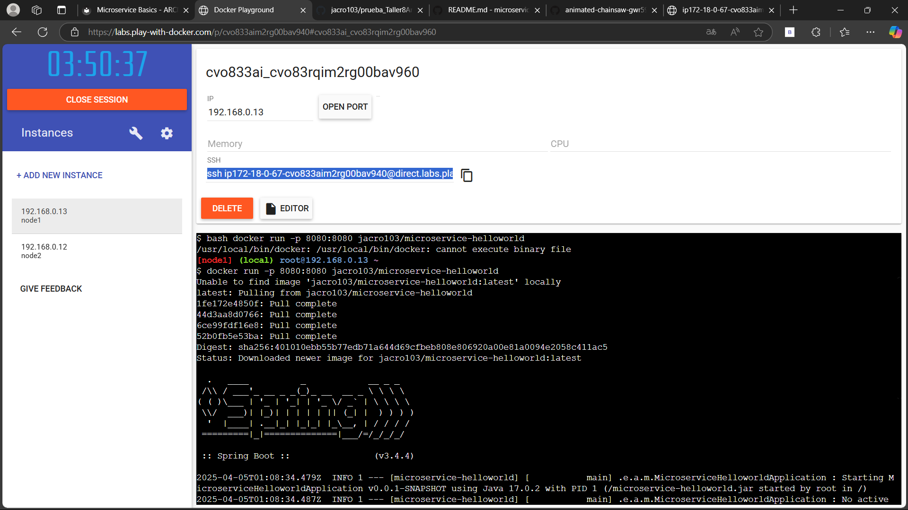
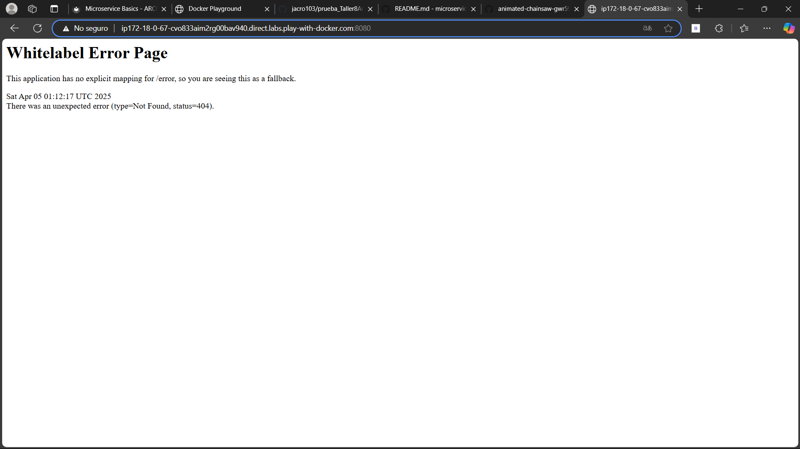
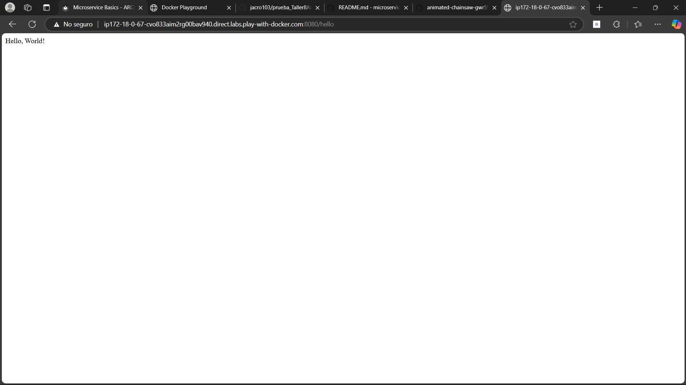

# Microservicio Hello World

Este proyecto consiste en la creación de un microservicio básico que responde con un mensaje "Hello, World!" utilizando Spring Boot y Docker. Se desarrolló en GitHub Codespaces y se desplegó con Play with Docker.

## General

* **Asignatura** Arquitectura Empresarial
* **Periodo académico** 2025-1

## Authors

* **Jose Alejandro Correa Rodriguez**

## Getting Started

El microservicio expone un endpoint `/hello` que retorna un mensaje de saludo. Puedes ejecutarlo localmente o desplegarlo usando Docker.

### Pasos principales:

1. Crear un repositorio en GitHub llamado `hello-world-microservice`.
2. Usar GitHub Codespaces con la configuración de `.devcontainer/devcontainer.json`.
3. Generar el proyecto con Spring Initializr (grupo `com.eci.arcn`, artefacto `microservice-helloworld`).
4. Crear un controlador `HelloWorldController.java` que responde en `/hello`.
5. Crear un `Dockerfile` para contenerizar la aplicación.
6. Subir la imagen a Docker Hub.
7. Ejecutar la imagen en Play with Docker.

### Prerequisites

Para ejecutar este proyecto necesitas tener instalado:

* Java 17
* Maven
* Docker

### Ejecutar localmente

1. Clona el repositorio:

```bash
git clone https://github.com/jacro103/prueba_Taller8Arep.git
cd hello-world-microservice
```

2. Compila el proyecto:

```bash
mvn clean package
```

3. Ejecuta la aplicación:

```bash
mvn spring-boot:run
```

4. Abre en tu navegador: [http://localhost:8080/hello](http://localhost:8080/hello)

### Construir imagen Docker

```bash
docker build -t microservice-helloworld .
```


### Subir a Docker Hub

```bash
docker tag microservice-helloworld tu-usuario/microservice-helloworld docker push tu-usuario/microservice-helloworld
```

### Ejecutar en Play with Docker

docker run -p 8080:8080 tu-usuario/microservice-helloworld






## Built With

* [Spring Boot](https://spring.io/projects/spring-boot) - Framework de desarrollo
* [Maven](https://maven.apache.org/) - Gestión de dependencias
* [Docker](https://www.docker.com/) - Contenerización
* [GitHub Codespaces](https://github.com/features/codespaces) - Entorno de desarrollo en la nube
* [Play with Docker](https://labs.play-with-docker.com/) - Simulador online de Docker
